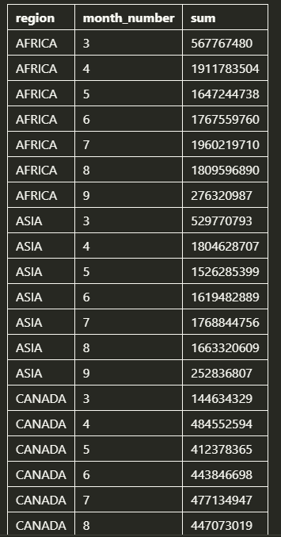
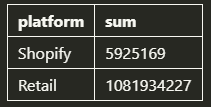

# data_mart
Step by step solution to 'Data with Danny's case study no. 5

Database schema can be found under https://8weeksqlchallenge.com/case-study-5/


The key business question to answer are the following:

1. What was the quantifiable impact of the changes introduced in June 2020?
2. Which platform, region, segment and customer types were the most impacted by this change?
3. What can we do about future introduction of similar sustainability updates to the business to minimise impact on sales?


# Data Cleansing

In a single query, perform the following operations and generate a new table in the data_mart schema named clean_weekly_sales:
- Convert the week_date to a DATE format
- Add a week_number as the second column for each week_date value, for example any value from the 1st of January to 7th of January will be 1, 8th to 14th will be 2 etc
- Add a month_number with the calendar month for each week_date value as the 3rd column
- Add a calendar_year column as the 4th column containing either 2018, 2019 or 2020 values
- Add a new column called age_band after the original segment column using the following mapping on the number inside the segment value
- Add a new demographic column using the following mapping for the first letter in the segment values
- Ensure all null string values with an "unknown" string value in the original segment column as well as the new age_band and demographic columns
- Generate a new avg_transaction column as the sales value divided by transactions rounded to 2 decimal places for each record

```
CREATE TABLE IF NOT EXISTS data_mart.clean_weekly_sales as 
SELECT
    week_date::DATE
    ,DATE_PART('week',week_date::DATE) as week_number
    ,DATE_PART('month', week_date::DATE) as month_number
    ,DATE_PART('year', week_date::DATE) as calendar_year
    ,region
    ,platform
    ,CASE WHEN segment IS NULL OR segment = 'null' THEN 'unknown'
          ELSE segment
          END AS segment
    ,CASE WHEN RIGHT(segment, 1) = '1' THEN 'Young Adults'
          WHEN RIGHT(segment, 1) = '2' THEN 'Middle Aged'
          WHEN RIGHT(segment, 1) = '3' OR RIGHT(segment, 1) = '4' THEN 'Retirees'
          ELSE 'unknown'
          END AS age_band
    ,CASE WHEN LEFT(segment, 1) = 'C' THEN 'Couples'
          WHEN LEFT(segment, 1) = 'F' THEN 'Families'
          ELSE 'unknown'
          END AS demographic
    ,customer_type
    ,transactions
    ,sales
    ,ROUND(sales/transactions,2) as avg_transaction
FROM data_mart.weekly_sales
```


# Data Exploration

## 1. What day of the week is used for each week_date value?

```
SELECT
    DISTINCT DATE_PART('isodow',week_date)
FROM data_mart.clean_weekly_sales
```
The outcome was '1' so it's Monday.

## 2. What range of week numbers are missing from the dataset?

```
WITH weeks as (
    SELECT
        DISTINCT week_number
        ,calendar_year
    FROM data_mart.clean_weekly_sales
    ORDER BY 2, 1)

SELECT
    *
    ,LEAD(week_number) OVER (PARTITION BY calendar_year ORDER BY week_number)
    ,LEAD(week_number) OVER (PARTITION BY calendar_year ORDER BY week_number) - week_number
FROM weeks
WHERE calendar_year = 2019
```
Weeks 1-12 and 37-52

## 3. How many total transactions were there for each year in the dataset?

```
SELECT
    calendar_year
    ,SUM(transactions)
FROM data_mart.clean_weekly_sales
GROUP BY calendar_year
ORDER BY calendar_year
```


## 4. What is the total sales for each region for each month?

```
SELECT
    region
    ,month_number
    ,SUM(sales)
FROM data_mart.clean_weekly_sales
GROUP BY region, month_number
ORDER BY region, month_number
```


## 5. What is the total count of transactions for each platform?

```
SELECT
    platform
    ,SUM(transactions)
FROM data_mart.clean_weekly_sales
GROUP BY platform
```


## 6. What is the percentage of sales for Retail vs Shopify for each month?

```
WITH cte as (
    SELECT
        month_number
        ,platform
        ,SUM(sales) as sales_by_platform
        ,t2.sales_by_month 
    FROM data_mart.clean_weekly_sales t1
    LEFT JOIN (SELECT month_number, SUM(sales) as sales_by_month FROM data_mart.clean_weekly_sales GROUP BY month_number) t2
    USING(month_number)
    GROUP BY month_number, platform, t2.sales_by_month
    ORDER BY month_number, platform
)

SELECT
    month_number
    ,platform
    ,sales_by_platform
    ,sales_by_month
    ,ROUND(sales_by_platform * 100.0 /sales_by_month, 2) as perc
FROM cte
```


## 7. What is the percentage of sales by demographic for each year in the dataset?

```
WITH cte as (
    SELECT
        calendar_year
        ,demographic
        ,SUM(sales) as sales_by_demo
        ,sales_by_year
    FROM data_mart.clean_weekly_sales t1
    LEFT JOIN (SELECT calendar_year, SUM(sales) as sales_by_year FROM data_mart.clean_weekly_sales GROUP BY calendar_year) t2
    USING(calendar_year)
    GROUP BY 1, 2, 4
    ORDER BY 1, 2
)
SELECT
    calendar_year
    ,demographic
    ,sales_by_demo
    ,sales_by_year
    ,ROUND(sales_by_demo * 100.0/sales_by_year, 2) as perc
FROM cte
```


## 8. Which age_band and demographic values contribute the most to Retail sales?

```
SELECT
    age_band
    ,demographic
    ,SUM(sales)
FROM data_mart.clean_weekly_sales
WHERE platform = 'Retail'
GROUP BY 1,2
ORDER BY 3 DESC;

SELECT
    age_band
    ,SUM(sales)
FROM data_mart.clean_weekly_sales
WHERE platform = 'Retail'
GROUP BY 1
ORDER BY 2 DESC;

SELECT
    demographic
    ,SUM(sales)
FROM data_mart.clean_weekly_sales
WHERE platform = 'Retail'
GROUP BY 1
ORDER BY 2 DESC;
```


## 9. Can we use the avg_transaction column to find the average transaction size for each year for Retail vs Shopify? If not - how would you calculate it instead?

```
SELECT
    calendar_year
    ,platform
    ,SUM(transactions) sum_trans
    ,SUM(sales) sum_sales
    ,SUM(sales)*1.0/SUM(transactions) as avg_trans
    ,AVG(avg_transaction) avg_trans2
FROM data_mart.clean_weekly_sales
GROUP BY 1,2
ORDER BY 1,2
```

